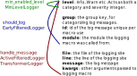

# Logging in Julia


## Logging stdlib and LoggingExtras.jl


.row[ .col[ .image-50[] ] ] .row[ .col[     **Frames White** (she/they) <br>     EDA & Compiler Engineer <br>


.image-40[] ] .col[ **JuliaCon** <br> 2023<br> Boston<br> ]  ]


---


## Can you chose a more difficult location for a conference?


.row[ .col[ .image-100[] ] .col[ Yes, we *could* be in Bermuda.


  * It took me over 32 hours to get here.
  * 18,700 km in great circle distance


] ] The problem is the remoteness of Boston, and not of Perth.


---


## History and Credit


  * LoggingExtras initially created in 2018 shortly after Julia 1.0 and the new Logging stdlib
  * We recently tagged v1.0 of LoggingExtra, though the core of it hasn't changed much since 2018
  * The Julia 1.0 logging stdlib was largely created by **Claire Foster**
  * Thanks also to other contributors, in particular **Fredrik Ekre** and **Jacob Quinn**


---


## Logging vs print


.row[ .col[ **Logging**


High level abstraction, with default fancy styling (by `ConsoleLogger`)


Routable with log plumbing


Always printed to stderr (by `ConsoleLogger`) (This is important for making unix commandline tools that pipe together)


] .col[ **Print**


Low level primitive for writing text to streams.


Outputs to the given stream. Defaults to stdout. ] ]


---


## Who is logging for ?


Logging is a servant with many masters


  * Operations Team monitoring production enviroment.

      * Probably using some tool liked Cloudwatch or SumoLogic work with the logs
  * The developer:

      * printline logging is the classic debugging technique
  * The end user

      * communicating the state of the program


---


## What is log plumbing?


.image-100[]


.col[ Direct the right content to the right place. ]


---


## What are the parts of a `AbstractLogger`? (1)


  * `handle_message(logger::AbstractLogger, args...; kwargs...)`

      * actually log the thing, in what ever sense that is
      * used by **sinks** (and several other compositional components)
  * `shouldlog(logger::AbstractLogger, args...)`

      * decide if to log ot not
      * This saves time avoiding evaluated computations in message or arguments to the log macro.
      * used by `EarlyFilteredLogger`


---


## What are the parts of a `AbstractLogger`? (2)


  * `min_enabled_level(logger::AbstractLogger)`

      * Even earlier filtering than `shouldlog` based on the lowest level this logger will accept.
      * used by `MinLevelLogger` filter.
  * `catch_exceptions(logger::AbstractLogger)`

      * ugly duck of the logging functions,
      * Only applicable to **sinks**
      * Does this logger eat exceptions thrown during log message preparation.


---


## What information is available when?


.image-100[ 


]


---


# Logging Filters


  * `MinLevelLogger`
  * `EarlyFilteredLogger`
  * `ActiveFilteredLogger`


---


# TeeLogger


It simply allows the same content to multiple loggers.


Used in conjunction with filters to


  * Apply Transforms to some inputs but not others
  * Send different messages to different files etc


There is no JoinLogger to do the reverse, because that is done by reusing the logger in the composition.


---


### Transformer


---


# Sinks


The final destination of a log message.


Responsible for 


---


# Sinks in LoggingExtras


---


# Other Sinks


  * Ten


---


# Examples


Most of these can be found in the LoggingExtras readme,  and/or the very good logging extras website


---


## Include stack-traces in every log messaage


```julia
stacktrace_logger(logger) = TransformerLogger(logger) do log
    st = stacktrace()[5:end]  # skip stuff from the logging system  
    pretty_st = ["[$ii] $frame" for (ii, frame) in enumerate(st)]
    kwargs = (;log.kwargs..., stacktrace=pretty_st)
    return merge(log,(;kwargs))
end;
```


.image-80[      ]


---


## Include stacktraces only in deprecation warnings


```julia
is_depwarn(log) = log.group==:depwarn

global_logger(
    TeeLogger(
        EarlyFilteredLogger(
            is_depwarn,
            stacktrace_logger(current_logger())
        ),
        EarlyFilteredLogger(!is_depwarn, current_logger())
    )
)
```


.image-100[      ]


---


## Enabling Debug messages for one module


---


## Muting a known warning


---


# Future Work


---


## Should the LoggingExtras examples have a package?


.row[ .col[ **Pros**


These things are useful


Would make them testable


Some are nonobvious ] .col[


] .col[ **Cons**


These things are really configurable


They are just not that long or complex ] ]


---


## We have no solution for deprecation warnings


This is [JuliaLang/Julia#49583](https://github.com/JuliaLang/julia/issues/49583).


In Julia 1.5 we made deprecations silent by default:


  * They were adding too much performance overhead (10μs)
  * They were often from dependencies of dependencies – not something the end user could fix


We would like to bring them back, but only occurring if it is *your code* that is calling the deprecated method.


---


## We have no solution for deprecation warning (2)


To work out if it is your code:


  * we need to know what module the calling code the code that called `depwarn`. i.e. `stacktrack()[2].module`.
  * But calling `stacktrace()` takes 40ms – way to expensive to use in a filter.


An alternative: 


  * we could throw deprecation warning if the `_module` at the `depwarn` log site is one of your direct dependencies
  * only cost about 10ns to check
  * but false positives for things that are both direct and indirect dependences.


---


## Group is a single value


Group is the main thing we have for assigning a category to a log message. But it makes more sense to think of this as a set of tags, than as a single category.


For example, the kinds of tags a system doing data processing might have includes `missing-data`, `model-fitting-issue`, `alert-pager` etc. and we could want to do `alert-pager` and `missing-data`


Further-more, the LoggingExtras verbosity macros `@infov`, `@warnv` etc store the verbosity in the group.


---


## No distinction between data and metadata


Often you want to talk to the logger at the call-site. The emergent way of doing this has been via setting keys.


For example, the `ConsoleLogger` accepts a `maxlog` to control repeated printing of same message.


```julia
for ii in 1:100
    @info "this mesage will be shown only 3 times" maxlog=3
end
```


But that will also print `maxlog=3` in every message, that doesn't special case it


---


## Console Logger is very complex


The `ConsoleLogger` is the opposite of a compositional logger.


It is a very nice sink, with lots of sensible and good rendering. It has the configurable `meta_formatter` for coloring and adding suffixed and prefixed to messages. It has code for shortenning long values, and for justification of text.


It does filtering based on the `maxlog` handle and the `id`.


A lot of this other loggers would like to reuse. Most of it wouldn't be enhanced by merely rewriting it as the composion of LoggingExtras types.


---


## `ConsoleLogger` color/naming is not centered on /Info/Warn/etc


---


## `JULIA_DEBUG` environment variable is not quite right


This is an enviroment variable that takes a list of package names to always show no matter what the `min_enabled_level(logger)` returns.


It's not part of the `ConsoleLogger` – it actually bypasses the logging system almost entirely.


It's not free and it can't be turned off. Takes about least 20ns to check an env that doesn't exist. This means you can't put logging in a tight loop, since no matter how you configure your logging setup you can't disable this check.


See: https://github.com/JuliaLogging/LoggingExtras.jl/issues/20


---


## Enabling debug logging is too annoying


Either swapping out the default logger, or using `JULIA_DEBUG` env-var and having to remember how it works.


In short term we should make `enable_debug_logging()` and `enable_debug_logging(module)` functions available in REPL.


---


## `file`/`line` should be available to `shouldlog`


There is no reason for it not to be


It is known at this time.


`group` is avaiable, and by default is set to the file but it might be being used for something else


Similar, for julia 1.10 the function name is known at macro expansion time, and that also could be made available at this time (and later)


---


## We have no Tables.jl logging sink


(AFAIK)


Particulary useful is using numerical keyed values


Something that could then naturally be passes to CSV.jl, or Arrow.jl etc to dump the logs to a file.


Or that could be passed to PrettyTables.jl to have a nice display of the values.


This would be natural as a companion to TensorBoardLogger

